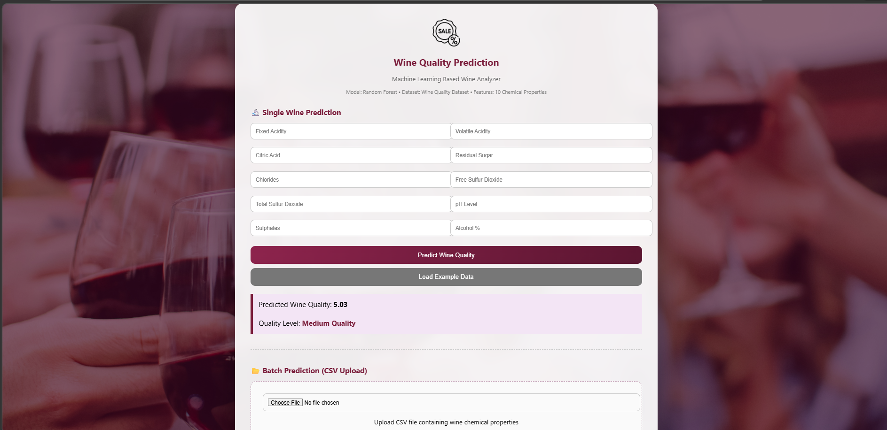
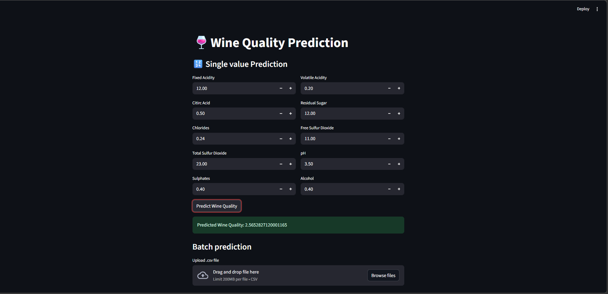
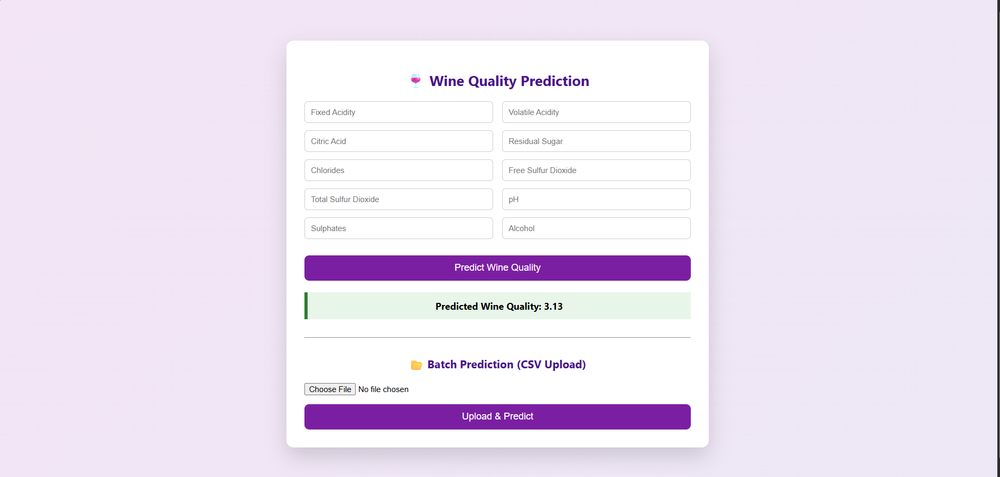

# 🍷 Wine Quality Prediction

An **end-to-end Machine Learning project** that predicts the quality of red wine based on its chemical properties.
The project includes **model training, API development, and interactive web interfaces** using Flask, FastAPI, and Streamlit.

---

# 📌 Project Overview

Wine quality depends on several chemical characteristics such as acidity, sugar level, pH, alcohol content, etc.
This project uses a **Machine Learning model trained on the UCI Wine Quality Dataset** to predict the quality score of wine.

The system supports:

* **Single wine prediction**
* **Batch prediction using CSV files**
* **Web interface for easy interaction**
* **REST API for integration**
* **Interactive Streamlit dashboard**

---

# 🚀 Features

✔ Predict wine quality using machine learning
✔ Flask web application for prediction
✔ FastAPI REST API for programmatic access
✔ Streamlit dashboard for interactive predictions
✔ Batch prediction using CSV upload
✔ Clean and modular project structure

---

# 🧠 Machine Learning Workflow

1. Data Loading
2. Data Cleaning and Preprocessing
3. Exploratory Data Analysis (EDA)
4. Feature Scaling
5. Model Training
6. Model Evaluation
7. Model Saving using **Joblib**

The trained model is stored and reused by the applications.

---

# 🛠 Tech Stack

* **Python**
* **Scikit-learn**
* **Pandas**
* **NumPy**
* **Flask**
* **FastAPI**
* **Streamlit**
* **Joblib**

---

# 📂 Project Structure

```
wine-quality-prediction
│
├── flask_app
│   ├── app.py
│   ├── templates
│   ├── model
│   └── requirements.txt
│
├── fastapi_app
│   ├── app.py
│   ├── model
│   └── requirements.txt
│
├── streamlit_app
│   ├── app.py
│   ├── model
│   └── requirements.txt
│
├── winequality_red.csv
├── wine_quality_batch_10_rows.csv
└── README.md
```

---

# 📸 Application Screenshots

### Flask Web Interface


### FastAPI Interface


### Streamlit Dashboard


---

# ▶️ Running the Project

## 1️⃣ Clone the Repository

```
git clone https://github.com/vinaybarhate/wine-quality-prediction.git
cd wine-quality-prediction
```

---

## 2️⃣ Run Flask App

```
cd flask_app
pip install -r requirements.txt
python app.py
```

---

## 3️⃣ Run FastAPI

```
cd fastapi_app
pip install -r requirements.txt
uvicorn app:app --reload
```

---

## 4️⃣ Run Streamlit Dashboard

```
cd streamlit_app
pip install -r requirements.txt
streamlit run app.py
```

---

# 📊 Dataset

Dataset used: **UCI Wine Quality Dataset**

The dataset contains chemical properties such as:

* Fixed Acidity
* Volatile Acidity
* Citric Acid
* Residual Sugar
* Chlorides
* Free Sulfur Dioxide
* Total Sulfur Dioxide
* Density
* pH
* Sulphates
* Alcohol

These features are used to predict the **wine quality score**.
---

# 🎯 Future Improvements

* Deploy the model on cloud platforms
* Add model performance visualization
* Add Docker containerization
* Build a full ML pipeline

---
## 📸 Application Screenshots

### Flask Web App


### Streamlit Dashboard


### FastAPI Interface

---

## 👨‍💻 Author

**Vinay Barhate**

Machine Learning and Data Science enthusiast focused on building practical ML applications.

GitHub:  
https://github.com/vinaybarhate
